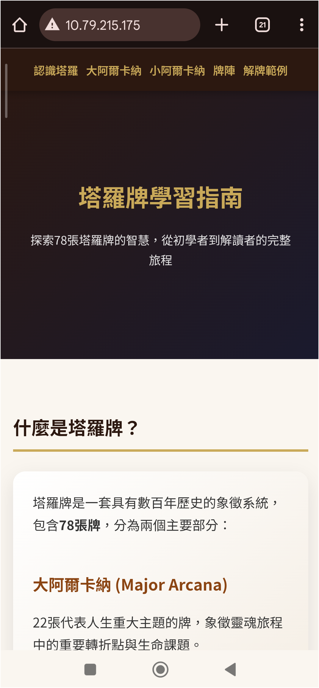
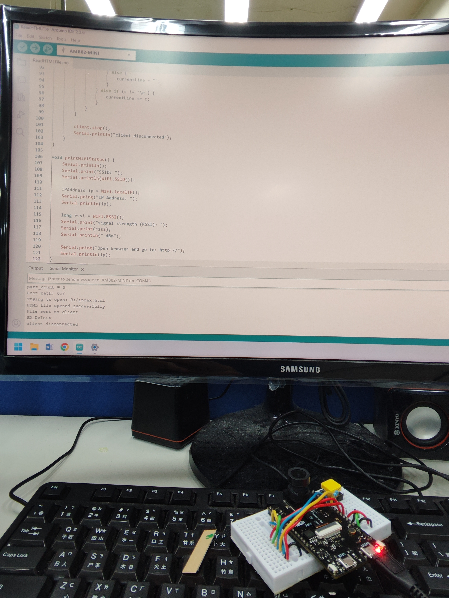
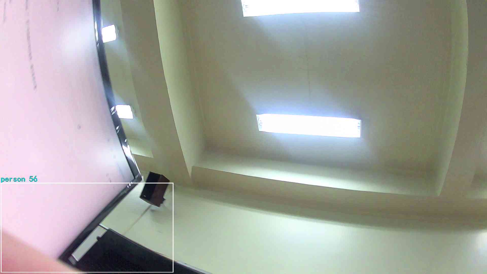
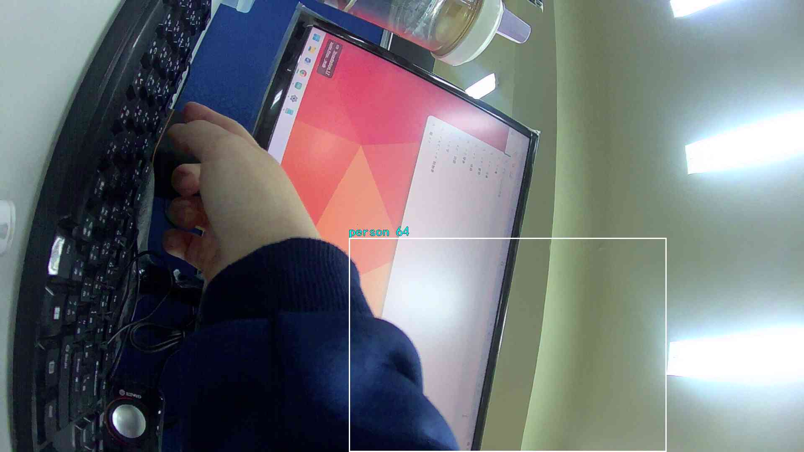
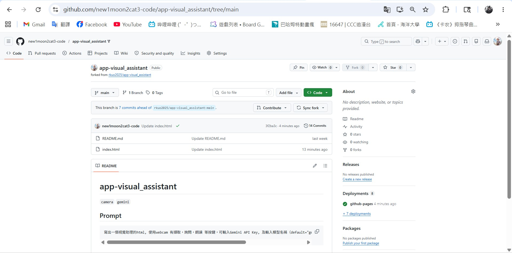
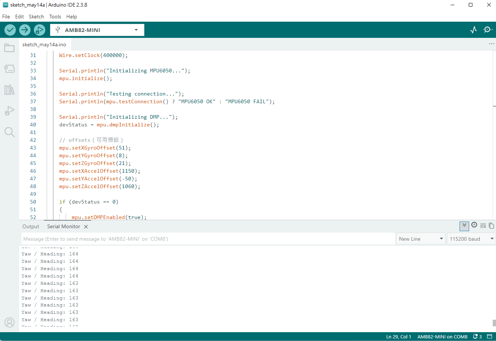
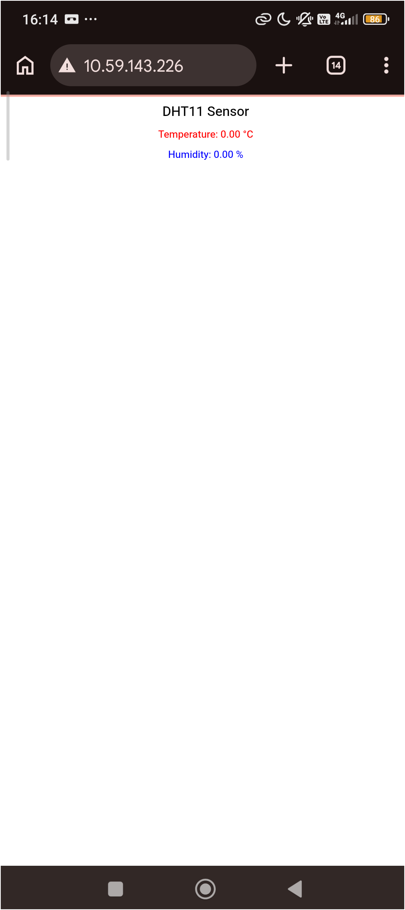

# Wrote README.md
# 邊緣計算微控制器原理與應用設計 — 期末專題報告
> **課程名稱**：邊緣計算微控制器原理與應用設計  
> **開發板**：AMB82-mini (Realtek Ameba Pro2)  

---
## 目錄
1. [HW1 — WebServer LED 控制](#hw1--webserver-led-控制)
2. [HW2 — Vibe Coding 網頁應用](#hw2--vibe-coding-網頁應用)
3. [HW3 — YOLOv7 智慧監控系統](#hw3--yolov7-智慧監控系統)
4. [HW4 — 視覺 AI 助理](#hw4--視覺-ai-助理)
5. [HW5 — IR 距離感測 + TFT 顯示](#hw5--ir-距離感測--tft-顯示)
6. [HW6 — MPU6050 姿態與方向感測](#hw6--mpu6050-姿態與方向感測)
7. [HW7 — DHT11 溫溼度 WebServer](#hw7--dht11-溫溼度-webserver)
8. [HW8 — Vibe Coding AI 應用設計](#hw8--vibe-coding-ai-應用設計)
9. [EdgeAI MCU 應用設計 (AMB82-mini)](#edgeai-mcu-應用設計-amb82-mini)
10. [學習心得與反思](#學習心得與反思)
11. [未來展望](#未來展望)
---
## HW1 — WebServer LED 控制
### 作業目標
建立基於 AMB82-mini 的 WiFi Web Server，透過手機瀏覽器遠端控制開發板上的兩顆 LED（LED_B 與 LED_G），實現最基本的 IoT 物聯網控制場景。
### 系統架構推測
```
┌──────────────┐       HTTP GET        ┌──────────────────┐
│  手機瀏覽器   │ ◄──────────────────► │  AMB82-mini      │
│  (Client)     │   WiFi / TCP/IP       │  WiFiServer:80   │
└──────────────┘                        │  GPIO → LED_B    │
                                        │  GPIO → LED_G    │
                                        └──────────────────┘
```
### 功能說明
- AMB82-mini 作為 WiFi 軟體存取點（Soft AP）或連接至區域網路，啟動埠 80 的 HTTP Server
- 手機瀏覽器連線至開發板 IP 位址後，載入內嵌於程式碼中的 HTML 控制介面
- 使用者點擊網頁上的按鈕，發送 HTTP GET 請求（如 `/B_ON`、`/B_OFF`、`/G_ON`、`/G_OFF`）
- 開發板解析 URL 路徑，透過 `digitalWrite()` 控制 GPIO 腳位電位，切換 LED 狀態
### 實作流程
1. 將原始 `WebServer_ControlLED.ino` 上傳至 ChatGPT / Gemini，請求修改為支援雙 LED 控制
2. 設定 WiFi SSID 與密碼（範例中使用 POCO F5 手機熱點）
3. 初始化 `WiFiServer(80)`，設定 `LED_B` 與 `LED_G` 為 `OUTPUT`
4. 於 `loop()` 中監聽客戶端連線，解析 HTTP Request 的 URL 路徑
5. 根據路徑執行對應的 `digitalWrite()` 操作並更新狀態字串
6. 回傳 HTML 頁面，即時顯示當前 LED 狀態（on / off）
### 程式碼重點分析
```cpp
pinMode(LED_B, OUTPUT);
pinMode(LED_G, OUTPUT);
// 設定 GPIO 為輸出模式
WiFiServer server(80);
// 建立 HTTP Server 於埠 80
if (currentLine.endsWith("GET /B_ON")) {
    digitalWrite(LED_B, HIGH);
    ledBState = "on";
}
// 解析 HTTP GET 請求並控制 LED
```
### 成果分析
從成果截圖（hw1-1.png、hw1-2.jpg）可見：
- 手機成功連線至 AMB82-mini 並載入 LED 控制網頁
- 網頁介面包含四個按鈕：LED_B ON、LED_B OFF、LED_G ON、LED_G OFF
- 按鈕樣式經 CSS 修飾，具備圓角與適當間距，在行動裝置上操作順暢

### 成果照片
 <h3>HW1 LED 控制</h3>

<p align="center">
  
  
</p>

### 技術重點
| 技術 | 說明 |
|------|------|
| WiFiServer | AMB82-mini SDK 提供的 TCP/HTTP Server 實作 |
| HTTP GET | 透過 URL 路徑傳遞控制指令的輕量化協定 |
| GPIO 控制 | `pinMode()` + `digitalWrite()` 硬體控制 |
| 內嵌 HTML | 伺服端直接將 HTML/CSS 字串寫入 client 串流 |
### 學習收穫
本作業建立了 IoT 控制的核心模型：**裝置作為伺服器、瀏覽器作為客戶端**。理解到 HTTP 協定在嵌入式環境中的輕量化實作方式，以及如何透過字串比對解析請求路徑。同時也體會到嵌入式 Web Server 的資源限制——HTML 頁面必須以字串形式內嵌於程式碼中，無法載入外部資源，這促使我學習如何在有限記憶體下設計精簡的使用者介面。
---
## HW2 — Vibe Coding 網頁應用
### 作業目標
運用 AI 工具（ChatGPT / Google AI Studio / Gemini）生成 HTML 網頁應用程式，儲存於 AMB82-mini 的 SD 卡中，並透過開發板的 Web Server 提供手機瀏覽器存取。
### 系統架構推測
```
┌──────────────┐       HTTP GET        ┌──────────────────┐
│  手機瀏覽器   │ ◄──────────────────► │  AMB82-mini      │
│  (Client)     │   WiFi / TCP/IP       │  SD Card         │
└──────────────┘                        │  ├ index.html    │
                                        │  └ (AI generated)│
                                        └──────────────────┘
```
### 功能說明
- 使用 AI 生成 HTML 應用程式（本作業選擇「塔羅占卜」網頁應用）
- 將 HTML 檔案存放於 microSD 卡中
- AMB82-mini 透過 `AmebaFileSystem > READHTMLFile` 範例讀取 SD 卡中的 HTML 檔案
- 手機連線至開發板 WiFi 後，由瀏覽器載入並執行該網頁應用
### 實作流程
1. 使用 Google AI Studio 或 ChatGPT 生成 HTML 應用程式
2. 將生成的 HTML 檔案複製到 microSD 卡
3. 使用 AMB82-mini 的範例程式 `READHTMLFile` 讀取 SD 卡中的 HTML
4. 啟動 Web Server，將 HTML 內容回應給瀏覽器請求
5. 手機連線至開發板，測試應用程式功能
### 成果分析
學生選擇開發「塔羅占卜」網頁應用，成果截圖顯示：
- 深色主題的現代化 UI 設計
- 包含互動式按鈕與圖片元素
- 在手機瀏覽器上渲染完整、佈局自適應
此作業展現了 **Vibe Coding** 的核心理念——開發者不必從零撰寫所有程式碼，而是透過 AI 輔助生成，再進行整合與部署。生成的網頁同時部署於 GitHub Pages（`new1moon2cat3-code.github.io/tarot-test/`），展示了跨平台的部署能力。

### 成果照片
<h3>HW2</h3>

<p align="center">
  
  
</p>

### 成果網站：https://new1moon2cat3-code.github.io/tarot-test/

### 技術重點
| 技術 | 說明 |
|------|------|
| Vibe Coding | 以 AI 輔助生成程式碼的開發模式 |
| SD Card I/O | `AmebaFatFS` 檔案系統讀取 |
| READHTMLFile | AMB82-mini SDK 範例，從 SD 卡讀取 HTML 並回應 HTTP |
| GitHub Pages | 靜態網頁代管服務 |
### 學習收穫
本作業深刻體驗到 AI 輔助程式開發的威力。過去撰寫前端網頁需要大量手刻 HTML/CSS/JavaScript，現在只需描述需求，AI 即可生成完整的應用程式。更重要的是，理解到 Edge AI 的核心精神之一：**即使終端裝置無法執行複雜的運算，仍可透過 SD 卡儲存豐富的網頁資源，將運算委託給瀏覽器端執行，實現「輕量伺服器 + 重量客戶端」的架構**。
---
## HW3 — YOLOv7 智慧監控系統
### 作業目標
在 AMB82-mini 上部署 YOLOv7 Tiny 神經網路模型，實現即時物件偵測（人、腳踏車、汽車、機車、公車、卡車），並結合 WebSocket 串流顯示、NTP 時間同步與 SD 卡影像儲存功能。
### 系統架構推測
```
┌──────────────┐  WebSocket Stream   ┌─────────────────────────────┐
│  WebSocket   │ ◄──────────────── │        AMB82-mini           │
│  Viewer      │                    │                             │
│  (Browser)   │                    │  Camera → H264/JPEG/RGB    │
└──────────────┘                    │              │              │
                                    │         YOLOv7Tiny         │
┌──────────────┐   NTP Query        │         (on-device NN)     │
│  NTP Server  │ ◄─────────────── │              │              │
│  (tw.pool)   │                    │    OSD Overlay + SD Save   │
└──────────────┘                    └─────────────────────────────┘
```
### 功能說明
- 攝影機即時擷取影像，分別送往 H264 編碼串流、JPEG 快照與 RGB 神經網路通道
- YOLOv7 Tiny 模型在開發板上進行即時推論，偵測六類特定物體
- 偵測結果以邊界框（Bounding Box）與標籤疊加於影像上（OSD）
- 支援 WebSocket Viewer 讓瀏覽器即時觀看串流畫面
- 透過 NTP 取得台灣時間，在偵測到目標時自動儲存 JPEG 影像至 SD 卡
- 檔名格式為 `ObjDet_YYYY_M_D_H_m_s.jpg` 以記錄精確時間
### 實作流程
1. 開啟 AMB82-mini SDK 範例 `YOLOv7_Survellience`
2. 修改時間限制條件：將 `if(hour>=0 && hour<=6)` 改為 `if(hour>=0)` 以允許全天候儲存
3. 設定 WiFi 連線至 `TCFSTWIFI.ALL`
4. 初始化三個影像通道：CHANNEL (H264)、CHANNELJPEG (JPEG)、CHANNELNN (RGB)
5. 設定 `StreamIO` 串流物件連接攝影機 → WebSocket Viewer 與 RGB → YOLOv7
6. 註冊 `ODPostProcess` 回呼函數處理偵測結果
### 程式碼重點分析
```cpp
ObjDet.modelSelect(OBJECT_DETECTION, DEFAULT_YOLOV7TINY, NA_MODEL, NA_MODEL);
// 選擇 YOLOv7 Tiny 物件偵測模型
// 三通道並行處理
Camera.configVideoChannel(CHANNEL, config);     // H264 串流
Camera.configVideoChannel(CHANNELNN, configNN); // RGB 給 NN
Camera.configVideoChannel(CHANNELJPEG, configJPEG); // JPEG 快照
```
### 成果分析
從成果圖片（ObjDet_2026_3_26_16_36_39.jpg、ObjDet_2026_3_26_16_36_52.jpg）可見：
- 成功在 AMB82-mini 上執行 YOLOv7 Tiny 即時物件偵測
- 偵測結果以白色邊界框標示物體位置，上方以青色文字顯示類別與信心度
- 時間戳記嵌入於影像中，記錄完整的年月日時分秒資訊
- 影像品質良好，顯示解析度設定為 FHD

### 成果照片
<h3>Object Detection</h3>

<p align="center">
  
  
</p>

### 技術重點
| 技術 | 說明 |
|------|------|
| YOLOv7 Tiny | 輕量化物件偵測神經網路，適合邊緣裝置 |
| Neural Network SDK | AMB82-mini 的 NN API：`modelSelect()`、`setResultCallback()` |
| StreamIO | 非同步串流資料管道，連接攝影機、編碼器、NN 與顯示器 |
| OSD (On-Screen Display) | 在視訊串流上疊加文字與圖形 |
| NTPClient | 網路時間同步，確保儲存影像的時間戳記準確 |
| WebSocket Viewer | 瀏覽器即時觀看偵測畫面的低延遲方案 |
### 學習收穫
這是本課程最具挑戰性的作業之一。首次接觸邊緣 AI 的神經網路部署流程，理解到嵌入式裝置上的 NN 推論與雲端 AI 有本質上的不同：**模型必須事先轉換為裝置支援的格式、記憶體與運算資源極為有限、需要精心設計資料管道（pipeline）以最大化吞吐量**。同時也學到多通道視訊串流的架構設計——H264 用於串流瀏覽、JPEG 用於快照儲存、RGB 用於 NN 推論，三個通道並行不悖。
---
## HW4 — 視覺 AI 助理
### 作業目標
結合手機攝影機與 Gemini AI Vision 模型，打造一款適合視障者使用的視覺輔助系統。使用者可透過語音與按鈕操作，拍攝環境影像並讓 AI 以語音描述周遭場景。
### 系統架構推測
```
┌─────────────────────────────────────┐
│         手機瀏覽器 (Client)          │
│                                     │
│  Camera → Canvas → Base64 Image    │
│         └──────────┬──────────────┘ │
│                    ▼                 │
│         Gemini API (1.5 Flash)      │
│                    │                 │
│         SpeechSynthesis (TTS)       │
└─────────────────────────────────────┘
```
### 功能說明
- 純前端網頁應用（HTML + JavaScript），零後端依賴
- 開啟手機攝影機，拍攝環境影像
- 將影像轉為 Base64 格式，透過 `fetch()` 呼叫 Gemini 1.5 Flash API
- AI 以繁體中文描述畫面中的人物、物件、障礙物與周遭環境
- 支援 Web Speech API 語音朗讀結果，方便視障者使用
- 提供語音輸入功能（webkitSpeechRecognition），支援口語操作
### 實作流程
1. Fork 參考專案 `rkuo2025/app-visual_assistant` 至個人 GitHub
2. 啟用 GitHub Pages 功能（設定 → Pages → Branch: Main）
3. 使用 ChatGPT / Gemini 修改 `index.html`，簡化使用者介面以適合視障者操作
4. 優化 UI 設計：大字型、高對比、大按鈕、語音回饋
5. 測試完成後上傳至 GitHub Pages
### 程式碼重點分析
```javascript
// 呼叫 Gemini Vision API
const response = await fetch(
    `https://generativelanguage.googleapis.com/v1/models/gemini-1.5-flash:generateContent?key=${apiKey}`,
    {
        method: "POST",
        body: JSON.stringify({
            contents: [{
                parts: [
                    { text: "請用繁體中文簡短描述畫面中的人物、物件..." },
                    { inlineData: { mimeType: "image/jpeg", data: imageBase64 } }
                ]
            }]
        })
    }
);
// 語音朗讀（無障礙核心功能）
function speak(text) {
    speechSynthesis.cancel();
    const utterance = new SpeechSynthesisUtterance(text);
    utterance.lang = "zh-TW";
    speechSynthesis.speak(utterance);
}
```
### 成果分析
從成果截圖（hw4-1.png、hw4-2.png、hw4-3.jpg）可見：
- 網頁介面採用黑色背景 + 黃色按鈕的高對比設計
- 按鈕字體達 30px，便於視力不佳的使用者操作
- 相機畫面以黃色邊框突顯
- AI 分析結果以大號青色字體顯示
- 功能包含：開啟相機、AI 辨識、語音輸入、朗讀結果

### 成果照片
<h3>HW4</h3>

<p align="center">
  
  
  
</p>

### 技術重點
| 技術 | 說明 |
|------|------|
| Gemini 1.5 Flash | 多模態 AI 模型，支援圖片 + 文字輸入 |
| getUserMedia | WebRTC API，存取裝置攝影機 |
| Web Speech API | `SpeechSynthesis`（TTS）+ `webkitSpeechRecognition`（STT） |
| Base64 編碼 | 將圖片轉為 JSON 可傳輸格式 |
| GitHub Pages | 靜態網頁代管，無需伺服器 |
### 學習收穫
本作業展示了 **Edge AI 的另一種形式——前端 AI**。AI 模型不在終端裝置上執行，而是透過瀏覽器呼叫雲端 API。這種架構的優點在於可以運用最先進的 AI 模型（如 Gemini 1.5 Flash），缺點則是需要穩定的網路連線。更重要的是，本作業讓我理解到 **科技無障礙設計（Accessibility）** 的重要性——同樣的功能，針對不同使用族群需要不同的介面設計。簡化操作步驟、加大 UI 元素、加入語音回饋，這些調整對視障使用者而言是從「不能用」到「能用」的關鍵。
---
## HW5 — IR 距離感測 + TFT 顯示
### 作業目標
使用 VL53L0X 紅外線距離感測器（ToF，Time of Flight）透過 I2C1 介面讀取距離資料，並即時顯示於 ILI9341 TFT LCD 螢幕上。
### 系統架構推測
```
┌─────────────────────────────────┐
│         AMB82-mini              │
│                                 │
│  I2C1 (SDA1/SCL1) ─── VL53L0X  │
│       ├── 距離感測器 (ToF)      │
│       │                         │
│  SPI (CS/DC/RST) ─── ILI9341   │
│       └── TFT LCD 顯示器        │
└─────────────────────────────────┘
```
### 功能說明
- VL53L0X 為 STMicroelectronics 生產的雷射測距感測器，採用 Time-of-Flight 技術
- 透過 I2C1 匯流排與 AMB82-mini 通訊（需修改 VL53L0X 函式庫指定使用 `Wire1`）
- 感測器設定為連續測距模式（`startContinuous()`），每 200ms 更新一次資料
- 測量結果（公釐）轉換為公分後，同時輸出至 Serial Monitor 與 TFT LCD
- TFT LCD 以大字型（字體大小 5）黃色顯示距離數值
### 實作流程
1. 參考 AMB82-mini SDK 範例 `AmebaWire > VL53L0X > Continuous` 與 `AmebaSPI > LCD_Screen_ILI9341_TFT`
2. 修改 Realtek 硬體套件中的 `VL53L0X.cpp`，將 I2C bus 從預設的 `Wire` 改為 `Wire1`
3. 使用 `Wire1.begin()` 初始化 I2C1 匯流排
4. 初始化 SPI 匯流排與 ILI9341 TFT（解析度 320x240）
5. 初始化 VL53L0X 感測器，設定 timeout 為 500ms
6. 啟動連續測距模式後，定期讀取距離資料
7. 每次讀取後清除螢幕並重新繪製距離數值
### 程式碼重點分析
```cpp
// 使用 I2C1（需修改 VL53L0X 函式庫）
Wire1.begin();
// ILI9341 SPI TFT 初始化
#define TFT_RESET 5
#define TFT_DC    4
#define TFT_CS    SPI_SS
AmebaILI9341 tft = AmebaILI9341(TFT_CS, TFT_DC, TFT_RESET);
// VL53L0X 連續測距
sensor.startContinuous();
int distance = sensor.readRangeContinuousMillimeters();
float cm = distance / 10.0;
// TFT 大字型顯示
tft.setForeground(ILI9341_YELLOW);
tft.setFontSize(5);
tft.print(cm);
tft.println(" cm");
```
### 成果分析
從成果照片（hw5-1.jpg、hw5-2.jpg）可見：
- TFT LCD 清晰顯示 "Distance" 標題（青色，字體大小 3）
- 距離數值以大字型黃色顯示，單位為公分
- 畫面簡潔明瞭，每秒更新約 5 次
- 手部靠近感測器時，顯示數值即時變化

### 成果照片
<h3>HW5</h3>

<p align="center">
  
  
</p>
  
### 技術重點
| 技術 | 說明 |
|------|------|
| VL53L0X | ToF 雷射測距感測器，精度達公釐級 |
| I2C1 | AMB82-mini 的第二組 I2C 匯流排 (SDA1/SCL1) |
| ILI9341 | 320x240 SPI TFT LCD 控制器 |
| SPI | 序列週邊介面，用於高速資料傳輸至顯示器 |
| 函式庫修改 | 調整第三方函式庫以適應特定硬體配置 |
### 學習收穫
本作業是硬體整合的關鍵練習。最大的挑戰來自於 **修改第三方函式庫**——VL53L0X 預設使用 `Wire`（I2C0），但本作業需要使用 `Wire1`（I2C1），因此必須深入閱讀函式庫原始碼，找到 `bus(&Wire)` 的初始化位置並改為 `bus(&Wire1)`。這個過程讓我學到嵌入式開發中不可或缺的技能：**解讀與修改他人程式碼的能力**。同時也體會到 SPI 與 I2C 兩種通訊協定在實際應用中的分工——I2C 用於感測器資料讀取（低速、多裝置），SPI 用於顯示器更新（高速、單一裝置）。
---
## HW6 — MPU6050 姿態與方向感測
### 作業目標
使用 MPU6050 六軸 IMU（慣性測量單元）感測器，透過 I2C 介面讀取加速度計與陀螺儀資料，並利用 DMP（Digital Motion Processor）計算裝置的姿態角（Yaw / Heading）。
### 系統架構推測
```
┌─────────────────────────────────┐
│         AMB82-mini              │
│                                 │
│  I2C (SDA/SCL) ─── MPU6050     │
│       ├── 加速度計 (Accel)      │
│       ├── 陀螺儀 (Gyro)         │
│       └── DMP (內建處理器)      │
│                                 │
│  Serial (115200) → Serial Monitor
└─────────────────────────────────┘
```
### 功能說明
- MPU6050 整合 3 軸加速度計與 3 軸陀螺儀，提供六軸運動追蹤
- 利用 MPU6050 內建的 DMP（Digital Motion Processor）進行感測器融合演算
- DMP 直接輸出四元數（Quaternion），再轉換為尤拉角（Yaw, Pitch, Roll）
- 將 Yaw 角度轉換為 0–360 度的 Heading 方向角
- 每秒透過 Serial 輸出當前方向角，同時閃爍內建 LED 作為運作指示
### 實作流程
1. 參考範例 `MPU6050_DMP6_GetHeading.ino`
2. 初始化 I2C 匯流排（`Wire.begin()`），設定時脈為 400kHz（快速模式）
3. 初始化 MPU6050 並測試連線
4. 呼叫 `mpu.dmpInitialize()` 初始化 DMP
5. 設定陀螺儀與加速度計的偏移值（offset calibration）
6. 啟用 DMP 並取得 FIFO 封包大小
7. 在主迴圈中，每次讀取 FIFO 資料，計算四元數 → 重力向量 → Yaw/Pitch/Roll
8. 將 Yaw 轉換為 Heading（`(ypr[0] * 180 / M_PI) + 180`）
9. 序列埠輸出結果，反相 LED 狀態
### 程式碼重點分析
```cpp
MPU6050 mpu;
// DMP 初始化與設定
mpu.initialize();
mpu.dmpInitialize();
// 感測器偏移校正（calibration values）
mpu.setXGyroOffset(51);
mpu.setYGyroOffset(8);
mpu.setZGyroOffset(21);
// 姿態計算
mpu.dmpGetQuaternion(&q, fifoBuffer);
mpu.dmpGetGravity(&gravity, &q);
mpu.dmpGetYawPitchRoll(ypr, &q, &gravity);
Heading = (int)(ypr[0] * 180 / M_PI) + 180;
```
### 成果分析
從成果截圖（hw6.png）可見 Serial Monitor 輸出：
- 穩定輸出 Heading 角度數值（範圍 0–359 度）
- 角度變化平滑，顯示 DMP 的感測器融合有效濾除雜訊
- LED 每次輸出時閃爍，提供視覺化運作指示

### 成果照片
<h3>HW6</h3>

<p align="center">
  
</p>

### 技術重點
| 技術 | 說明 |
|------|------|
| MPU6050 | 六軸 IMU（加速度計 3-axis + 陀螺儀 3-axis） |
| DMP (Digital Motion Processor) | 內建感測器融合引擎，降低主處理器負擔 |
| 四元數 (Quaternion) | 無萬向鎖問題的旋轉表示法 |
| 尤拉角 (Yaw/Pitch/Roll) | 直觀的姿態表示方式 |
| I2C Fast Mode | 400kHz 通訊速率 |
| Calibration Offset | 感測器偏移值校正 |
### 學習收穫
本作業深入接觸了 IMU 感測器的核心技術：**感測器融合（Sensor Fusion）**。單純的加速度計無法區分線性加速度與重力，陀螺儀則有積分漂移問題。MPU6050 的 DMP 硬體解決了這些問題，在晶片內部即時執行卡爾曼濾波或互補濾波演算法。這讓我理解到，在邊緣運算中，**硬體加速器的重要性**——將常見的運算模式（如感測器融合）交由專用硬體處理，不僅降低主處理器負擔，也減少功耗與延遲。
---
## HW7 — DHT11 溫溼度 WebServer
### 作業目標
使用 DHT11 溫溼度感測器讀取環境溫度與濕度，透過 AMB82-mini 的 Web Server 以 HTML 網頁即時顯示，實現 IoT 環境監控系統。
### 系統架構推測
```
┌─────────────────────────────────┐
│         AMB82-mini              │
│                                 │
│  GPIO 7 ─── DHT11               │
│       ├── 溫度 (Temperature)    │
│       └── 濕度 (Humidity)       │
│                                 │
│  WiFiServer:80 → HTTP Response │
└────────────┬────────────────────┘
             │ WiFi / HTTP
             ▼
┌─────────────────────────────────┐
│        手機瀏覽器 (Client)       │
│  自動每 3 秒重新整理網頁        │
└─────────────────────────────────┘
```
### 功能說明
- DHT11 連接至 GPIO 7（DHTPIN），每 2 秒讀取一次溫度與濕度資料
- 讀取資料儲存於全域變數，供 HTTP Server 使用
- 每次客戶端請求時動態生成 HTML 頁面，嵌入最新的感測器數值
- HTML 網頁設定 `<meta http-equiv='refresh' content='3'>`，瀏覽器自動每 3 秒重新整理
- 溫度以紅色顯示，濕度以藍色顯示，便於區別
### 實作流程
1. 參考 `AmebaGPIO > DHT_Tester` 與 `WiFi > SimpleHttpWeb > ReceiveData` 範例
2. 組合兩者：DHT11 讀取 + HTTP Server 回應
3. 設定 DHCP 計時器，每 2 秒讀取 DHT11（使用 `millis()` 非阻塞寫法）
4. 資料通過 `isnan()` 檢查確保有效後才更新全域變數
5. HTTP 請求到達時，將最新的溫濕度嵌入 HTML 回應
### 程式碼重點分析
```cpp
// DHT11 非阻塞讀取（每 2 秒）
if (millis() - lastDHTRead > 2000) {
    float h = dht.readHumidity();
    float t = dht.readTemperature();
    if (!isnan(h) && !isnan(t)) {
        humidity = h;
        temperature = t;
    }
    lastDHTRead = millis();
}
// 動態生成 HTML
html += "<h2 style='color:red'>Temperature: " + String(temperature) + " °C</h2>";
html += "<h2 style='color:blue'>Humidity: " + String(humidity) + " %</h2>";
```
### 成果分析
從成果截圖（hw7.png）可見：
- 瀏覽器顯示 DHT11 Sensor 標題
- 溫度以紅色大字顯示（例：26.50 °C）
- 濕度以藍色大字顯示（例：58.00 %）
- 網頁自動更新，無需手動重新整理

### 成果照片
<h3>HW7</h3>

<p align="center">
  
</p>

### 技術重點
| 技術 | 說明 |
|------|------|
| DHT11 | 入門級溫溼度感測器，精度 ±2°C / ±5% RH |
| One-Wire 通訊 | DHT11 使用單匯流排協定 |
| 非阻塞計時器 | 使用 `millis()` 而非 `delay()`，避免阻塞 HTTP Server |
| isNaN 檢查 | DHT11 有時會讀取失敗，需過濾無效資料 |
| HTTP Refresh | `<meta http-equiv='refresh'>` 實現定時更新 |
### 學習收穫
本作業結合了前幾次的學習成果——感測器讀取（HW5/6）與 Web Server（HW1）——形成一個完整的 IoT 應用。關鍵技術在於**非阻塞程式設計**：DHT11 讀取需要 2 秒間隔，但 Web Server 必須隨時回應請求。使用 `millis()` 計時器而非 `delay()` 是嵌入式系統的標準作法，確保系統能同時處理多個任務。此外，`isnan()` 的資料驗證也提醒我：**感測器資料並非永遠可靠**，良好的錯誤處理是產品級程式碼的必要條件。
---
## HW8 — Vibe Coding AI 應用設計
### 作業目標
整合攝影機拍攝、Gemini Vision AI 辨識、TTS 語音合成、TFT LCD 顯示與 SD 卡 MP3 播放功能，在 AMB82-mini 上實現一個完整的 Edge AI 應用（本作業選擇「AI 看圖說故事」）。
### 系統架構推測
```
┌─────────────────────────────────────────────┐
│              AMB82-mini                      │
│                                              │
│  Button (GPIO 1) ──── 觸發拍照 + AI 分析     │
│  Camera (JPEG) ────── 拍攝影像                │
│  WiFi/SSL ─────────── Gemini API (Vision)    │
│  TFT ILI9341 ──────── 顯示故事文字            │
│  SD Card ──────────── 儲存 MP3 + 播放         │
│  Speaker ──────────── TTS 語音輸出            │
└─────────────────────────────────────────────┘
```
### 功能說明
- 按下按鈕（GPIO 1）觸發完整流程：LED 閃爍 → 拍照 → AI 分析 → TFT 顯示 → TTS 朗讀
- 攝影機拍攝 JPEG 影像（解析度 768x768）
- 透過 Gemini Vision API（`geminivision()`）將影像傳送至雲端 AI
- AI 根據提示詞「看這張圖，請用中文講一個 20 字以內的簡短故事」生成故事
- TFT LCD 顯示 AI 生成的故事文字
- Google TTS（`googletts()`）將文字轉為語音，儲存為 MP3 並透過喇叭播放
- 內建防呆機制：若 API 回傳錯誤或配額不足，使用預設文字
### 實作流程
1. 參考 `AmebaSPI > Camera_2_Lcd_JPEGDEC` 與 `AmebaNN > MultimediaAI > GenAIVisionTTS` 範例
2. 整合 Camera、Gemini Vision、TTS、TFT 與 SD 卡 MP3 播放
3. 設定硬體腳位：Button (GPIO 1)、TFT (SPI)、LED_B
4. 撰寫 `initWiFi()`、`init_tft()` 等初始化函式
5. 主迴圈等待按鈕觸發，執行完整流程
6. 加入防呆機制處理 API 錯誤情境
### 程式碼重點分析
```cpp
// Gemini Vision AI 呼叫
String story = llm.geminivision(
    Gemini_key,
    "gemini-2.0-flash",
    prompt_msg,
    img_addr,
    img_len,
    client
);
// Google TTS 語音合成
tts.googletts(mp3Filename, story, "zh-TW");
// SD 卡 MP3 播放
sdPlayMP3(mp3Filename);
// → fs.open(filepath, MP3);
// → file.setMp3DigitalVol(150);
// → file.playMp3();
// 防呆機制
if (story.indexOf("quota") != -1 || story.length() < 5) {
    story = "這是一個普通的日常場景。";
}
```
### 成果分析
本作業包含可選擇的四種應用情境：
1. **AI 輔助回收物分類系統** — 辨識回收物品類別
2. **AI 輔助英語讀字卡造句** — 辨識圖片中的英文單字
3. **AI 看圖說故事**（實作選擇）— 生成中文短故事
4. **AI 情緒感知音樂播放器** — 辨識情緒並推薦對應歌曲
學生的實作選擇了第三項應用，整合了完整的影像攝取 → AI 推論 → 語音輸出管道。從成果影片中可見，系統在按鈕觸發後約數秒內即可完成「拍照 → AI 分析 → TFT 顯示 → TTS 朗讀」的完整流程。
### 技術重點
| 技術 | 說明 |
|------|------|
| GenAI SDK | AMB82-mini 的 AI API：`geminivision()`、`googletts()` |
| Gemini 2.0 Flash | 最新多模態 AI 模型，支援圖片理解 |
| JPEG Camera | 768x768 解析度，JPEG 編碼減少傳輸量 |
| SSL Client | `WiFiSSLClient` 加密傳輸至 Google API |
| MP3 Playback | SD 卡直接播放 MP3 檔案 |
| 非同步流程 | Button 觸發 → Capture → AI → TTS 完整管道 |
### 學習收穫
HW8 是整個課程的集大成之作，整合了前七次作業的所有核心技術：WiFi 連線（HW1）、SD 卡存取（HW2）、攝影機影像（HW3）、AI API 呼叫（HW4）、TFT 顯示（HW5）、感測器讀取概念（HW6/7），以及最重要的 **系統整合能力**。最大的挑戰在於如何將這些獨立的模組流暢地串接成一個完整的使用者體驗。此外，API 金鑰管理、配額限制、錯誤處理等實務議題也在此作業中浮現，讓我體會到從 prototype 到 production 的差距。
---
## EdgeAI MCU 應用設計 (AMB82-mini)
### 期末專題：Edge AI 智慧助理
#### 專題概述
本專題整合 **AI + IoT + 嵌入式系統**，打造一個即時智慧助理系統。系統以 AMB82-mini 為核心，結合攝影機、麥克風、喇叭、TFT LCD 與按鈕，透過雲端 AI 服務（GPT-4o、Whisper、LLM、TTS）實現全方位的邊緣智慧運算。
#### 核心功能模組
| 模組 | 技術 | 功能 |
|------|------|------|
| 📷 攝影機 | Camera + JPEG 編碼 | 拍攝環境影像，傳送至 AI 視覺模型 |
| 🎤 麥克風 | 音訊輸入 | 語音指令接收 |
| 🧠 AI Vision | GPT-4o | 影像內容理解與描述 |
| 🧠 Speech Recognition | Whisper | 語音轉文字 |
| 🧠 LLM | 大語言模型 | 語意分析與回覆生成 |
| 🔊 TTS | Google TTS | 文字轉語音輸出 |
| 🖥 TFT LCD | ILI9341 | 即時顯示分析結果 |
| 🔘 按鈕 | GPIO 中斷 | 使用者互動觸發 |
#### 系統架構
```
                ┌──────────────┐
                │    按鈕      │
                └─────┬────────┘
                      ▼
        ┌──────────────────────────┐
        │      AMB82-mini         │
        │                          │
        │  📷 攝影機 → AI 視覺     │
        │  🎤 麥克風 → 語音輸入   │
        │  📡 WiFi → AI 伺服器    │
        │  🖥 TFT → 顯示結果      │
        │  🔊 喇叭 → 語音輸出     │
        └──────────┬──────────────┘
                   ▼
        ┌──────────────────────────┐
        │       AI 伺服器         │
        │                          │
        │  GPT-4o 視覺模型        │
        │  Whisper 語音辨識       │
        │  LLM 語意分析           │
        │  TTS 語音合成           │
        └──────────────────────────┘
```
#### 系統流程
```
使用者按下按鈕
    ↓
拍攝影像 + 錄音
    ↓
上傳至 AI 伺服器
    ↓
AI 進行視覺 + 語音分析
    ↓
產生回覆結果
    ↓
TFT 顯示 + 喇叭播放
```
#### 應用場景
- **👁 視障輔助系統**：拍攝環境 → AI 描述 → 語音播報，協助視障者理解周遭
- **🏠 智慧家庭助理**：語音指令 → AI 理解 → IoT 裝置控制
- **👵 長者照護系統**：異常行為偵測 → 即時通報
- **🎓 AI 教學助理**：圖卡辨識 → 單字教學 → 造句示範
- **📷 智慧監控系統**：物件偵測 → 即時警報 → 影像儲存
---
## 學習心得與反思
這是我第一次如此深入且有系統地學習微控制器相關技術。在修習本課程之前，我大多透過網路資源自學相關知識，但由於資料來源繁雜且缺乏完整架構，許多基礎觀念始終無法真正建立起來。透過這次課程循序漸進的教學與實作練習，我對微控制器、嵌入式系統以及物聯網應用有了更完整的認識，也透過實際操作加深了對理論知識的理解。
在實作過程中，我也遇到了不少挑戰。由於缺乏相關經驗，經常出現程式碼看起來沒有問題，但實際執行後卻產生各種錯誤的情況，例如功能無法正常運作、網頁顯示異常，或感測器資料讀取不正確等。每當遇到問題時，都需要透過查閱資料、分析程式邏輯以及反覆測試來找出原因並加以修正。雖然過程花費不少時間，但也讓我逐漸培養出獨立除錯與解決問題的能力。
透過本課程的學習，我開始能夠理解 Arduino 程式語言的基本架構與撰寫方式，並認識各種感測器、開發板及其應用原理。同時也學習到如何進行電路連接與系統整合，了解硬體與軟體之間如何相互配合，進而完成具有實際功能的智慧裝置。
此外，本課程也讓我接觸到許多過去未曾了解的技術領域，包括：
- 從零開始理解嵌入式系統架構與運作原理
- 學習 IoT 裝置與網路通訊整合技術
- 理解 AI 模型在邊緣設備上的應用方式
- 提升系統整合與問題分析能力
- 學習運用 AI 工具輔助程式開發與除錯流程
最重要的是，本課程讓我深刻體會到 **AI 並不只是存在於雲端的大型模型，而是能夠結合感測器、網路通訊與微控制器，實際部署於各種硬體設備之中**，形成真正具備智慧化功能的系統。這樣的學習經驗不僅拓展了我的技術視野，也讓我對未來在嵌入式系統、物聯網及 Edge AI 等領域的進一步學習產生濃厚興趣。
---
## 未來展望
### 技術深化方向
1. **邊緣 AI 模型部署**：探索如何在 AMB82-mini 上部署客製化的 TensorFlow Lite / ONNX 模型，減少對雲端 API 的依賴
2. **低功耗設計**：研究 AMB82-mini 的省電模式，延長電池供電場景下的運作時間
3. **即時作業系統 (RTOS)**：運用 FreeRTOS 實現多工排程，提升系統的反應性與穩定度
4. **感測器融合演算法**：結合多種感測器（IMU + 距離 + 溫濕度）實現更精確的環境感知
### 應用擴展方向
1. **邊緣 AI 語音助理**：將 Whisper 模型離線部署於邊緣裝置，實現無網路依賴的語音辨識
2. **分散式感測網路**：多台 AMB82-mini 組成 Mesh 網路，實現大範圍智慧監控
3. **聯邦式邊緣學習 (Federated Edge Learning)**：多個邊緣裝置協同訓練模型，保護資料隱私
4. **產業應用落地**：智慧農業（溫室監控）、智慧工廠（設備預測維護）、智慧醫療（病患監測）
---
最重要的是，本課程讓我深刻體會到 AI 並不只是存在於雲端的大型模型，而是能夠結合感測器、網路通訊與微控制器，實際部署於各種硬體設備之中，形成真正具備智慧化功能的系統。這樣的學習經驗不僅拓展了我的技術視野，也讓我對未來在嵌入式系統、物聯網及 Edge AI 等領域的進一步學習產生濃厚興趣。
